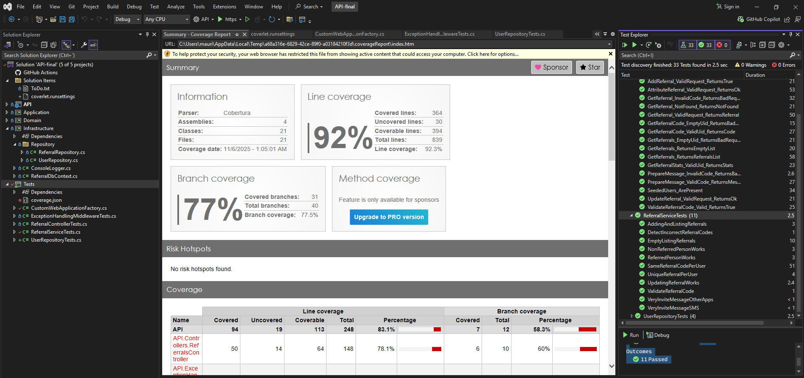

# Livefront Coding Challenge

## LCC - Tech Notes

- Clean Architecture implemented (Domain, Infrastructure, Application, Api)
- Separation of Concerns
- InMemory Entity Framework (with seeded data)
- Unit Testing (of service and actual endpoints)
- DTO and Fluent Validation
- Repository Pattern
- Dependency Injection
- Interface Segregation applied
- DRY
- SOLID
- Logging 

## SETUP

Requirements
- .NET 8.0

Clone this repo
- git clone https://github.com/mauriciogracia/LCC.git

Go to repo folder
- cd LLC (or the folder where you clone it)

Restore packages and build
- dotnet restore
- dotnet build

To run tests 
- dotnet test
- dotnet run --project LCC/API.csproj

Open 
- http://localhost:5097/swagger/index.html

## Test coverage
- Unit tests && Integration tests were added to achieve a 92% coverage
